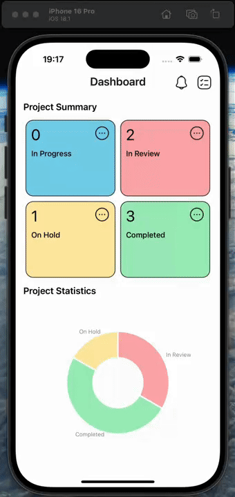
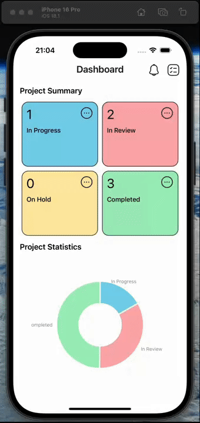

# Musemind - React Native Redux Thunk

This task tracking application built with React Native uses Redux as a central state management tool and Thunk for asynchronous operations. New tasks can be added, existing tasks can be updated and deleted in the application. The number of tasks according to their state values ​​and percentage statistics can be monitored on a dashboard.

## Technologies and Libraries Used

- React Native
- React Navigation
- React Redux
- Redux
- Redux Thunk
- React Native Safe Area Context
- React Native Screens
  \_ React Native svg
- React Native Community/DateTimePicker
- Iconsax React Native

## GIF

# Musemind-React-Native-Redux-Thunk
